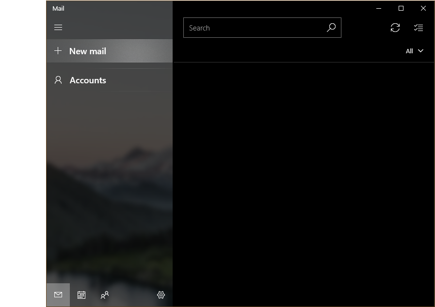
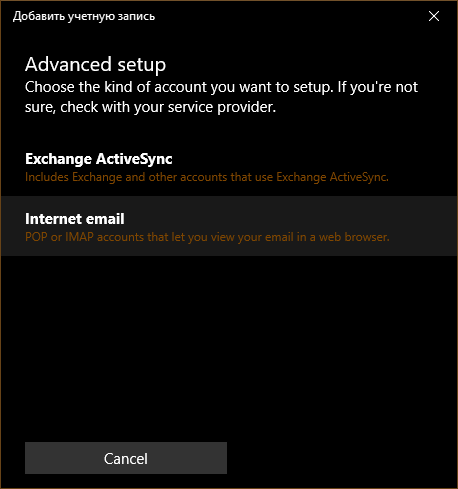
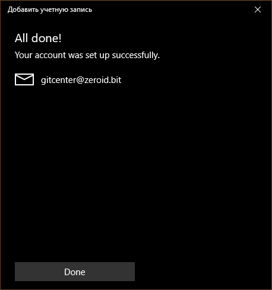
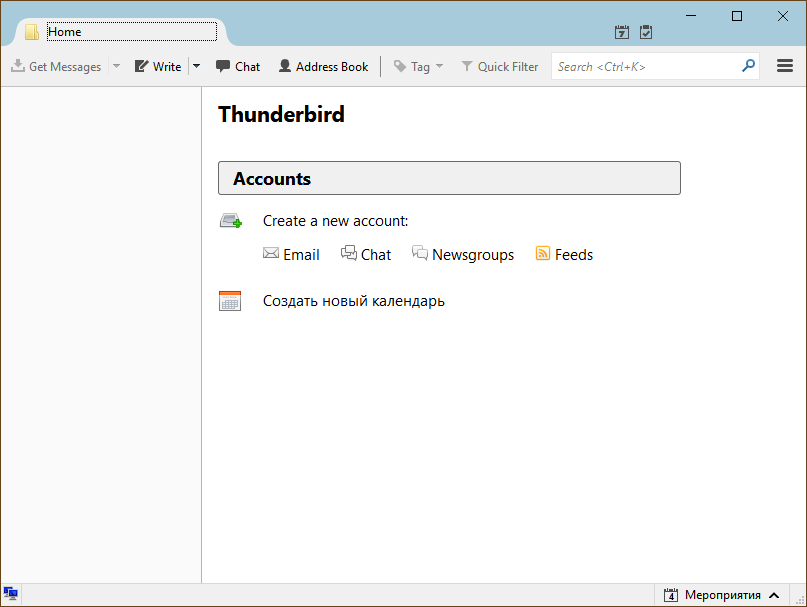
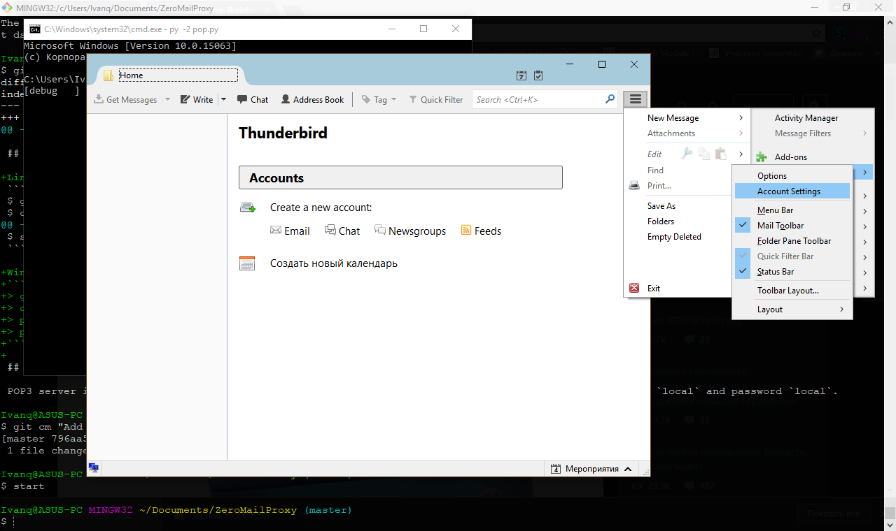
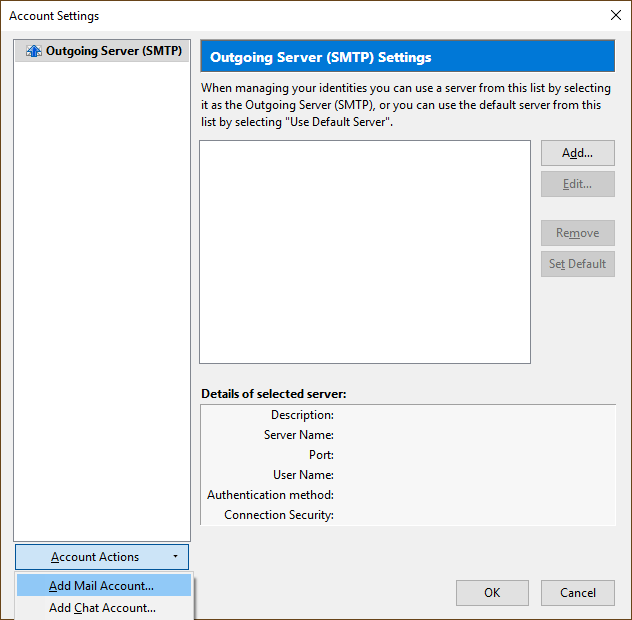
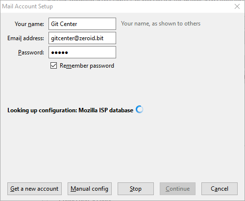
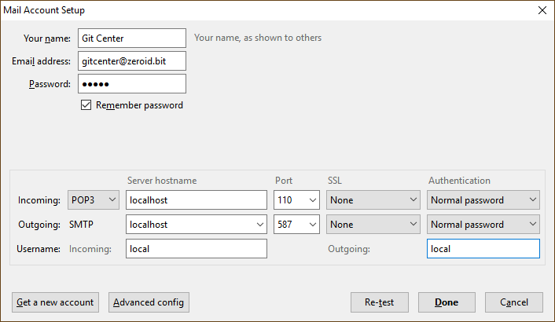
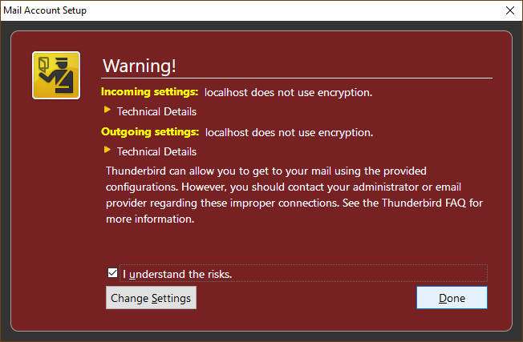

# ZeroMailProxy

A fast, lightweight server for [ZeroMail](https://github.com/HelloZeroNet/ZeroMail), written in Python.

## TODO

1. Usable command line client
2. ~~Start POP3 and SMTP server in one process~~
3. ~~HTML/Markdown not handled~~
4. ~~Support HELO and VRFY~~
5. ~~SMTP server~~
6. ~~May be problems with multipart~~
7. ~~Command-line client~~
8. ~~Publish changes~~
9. ~~Automatically create secrets~~
10. ~~Sign changes~~
11. ~~Send message not only to yourself~~
12. ~~POP3 server~~

## Installation and usage

Linux:
```bash
$ git clone https://github.com/imachug/ZeroMailProxy
$ cd ZeroMailProxy
$ sudo python start_server.py # Run local POP3 and SMTP servers
```

Windows:
```
> git clone https://github.com/imachug/ZeroMailProxy
> cd ZeroMailProxy
> python start_server.py # Run local POP3 and SMTP servers
```

## Local servers

POP3 and SMTP servers are ready out-of-box. To use them, configure your mail client to use `localhost:110` with login `local` and password `local` for POP3 and `localhost:587` with the same login/password for SMTP.

## Example for Windows Mail client

1. Run POP3 server
2. Run Windows Mail  
  
3. Press *Accounts* and then *+ Add account*
4. Scroll to very bottom and choose *Advanced setup*  
  
5. Choose *Internet email*  
  
6. Set:  
  
    - *Email address* to `<yourzeroid>@zeroid.bit`
    - *User name* to `local`
    - *Password* to `local`
    - *Account name* to anything you want  
  
    - *Send your messages using this name* to `local`
    - *Incoming email server* to `localhost`
    - *Account type* to `POP3`
    - *Outgoing (SMTP) email server* to `localhost`  
  
    - Uncheck *Require SSL for incoming email*
    - Uncheck *Require SSL for outgoing email*
7. Press *Sign in*
8. Press *Done*  

9. Wait until your mail is synchronized

## Example for ThunderBird

1. Run POP3 server
2. Run SMTP server
3. Open ThunderBird  
  
4. Open *Menu* -> *Options* -> *Account Settings*  
  
5. Press *Account Actions* -> *Add Mail Account...*  
  
6. Set *Your name* to anything you want, *Email address* to `<yourzeroid>@zeroid.bit`, *Password* to `local` and press `Continue`  
  
7. ThunderBird will try to configure everything manually - stop that by pressing *Manual config*
8. Set:
    - *Incoming* to `POP3 | localhost | 110 | None | Normal password`
    - *Outgoing* to `SMTP | localhost | 587 | None | Normal password`
    - *Username* to `local | local`  
  
9. Press *Re-test* and then *Done*
10. Accept warning  
  
11. Close menu and press *Get messages*

## Command-line client

1. Run `python send.py`
2. Type subject and body
3. Set recipient (make sure you ZeroMail'ed them before)
4. Wait for signing and publishing

Or run `python main.py` to read mail.

### Example session

```bash
$ python send.py
ZeroID: 1Cy3ntkN2GN9MH6EaW6eHpi4YoRS2nK5Di
Private key: 5KVc********************************************AjX
Subject:Test
Body: (empty line finishes)
Testing!

Recipient (e.g. gitcenter):gitcenter
$
```