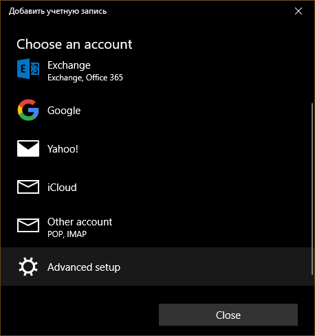
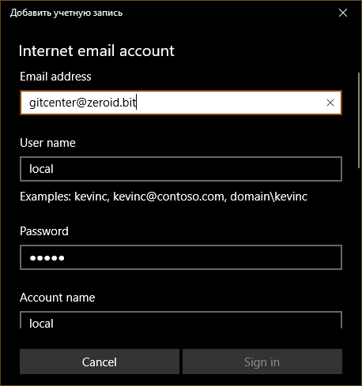
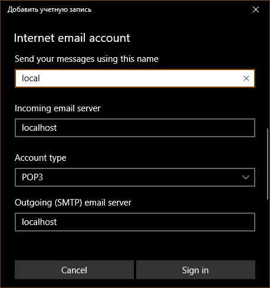
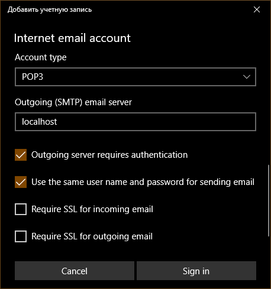

# ZeroMailProxy

A fast, lightweight server for [ZeroMail](https://github.com/HelloZeroNet/ZeroMail), written in Python.

## Installation and usage

```bash
$ git clone https://github.com/imachug/ZeroMailProxy
$ cd ZeroMailProxy
$ sudo python pop.py # Run local POP3 server
$ sudo python smtp.py # Run local SMTP server
```

## Local servers

POP3 server is finished. To make it work, configure your mail clinet to use `localhost:110` with login `local` and password `local`.

## Example for Windows Mail client

1. Run POP3 server
2. Run Windows Mail

3. Press *Accounts* and then *+ Add account*
4. Scroll to very bottom and choose *Advanced setup*

5. Choose *Internet email*

6. Set:

    - *Email address* to `<yourzeroid>@zeroid.bit`
    - *User name* to `local`
    - *Password* to `local`
    - *Account name* to anything you want

    - *Send your messages using this name* to `local`
    - *Incoming email server* to `localhost`
    - *Account type* to `POP3`
    - *Outgoing (SMTP) email server* to `localhost`

    - Uncheck *Require SSL for incoming email*
    - Uncheck *Require SSL for outgoing email*
7. Press *Sign in*
8. Press *Done*

9. Wait until your mail is synchronized

## Example for ThunderBird

*Coming soon*

## Command-line client

*Coming soon*
